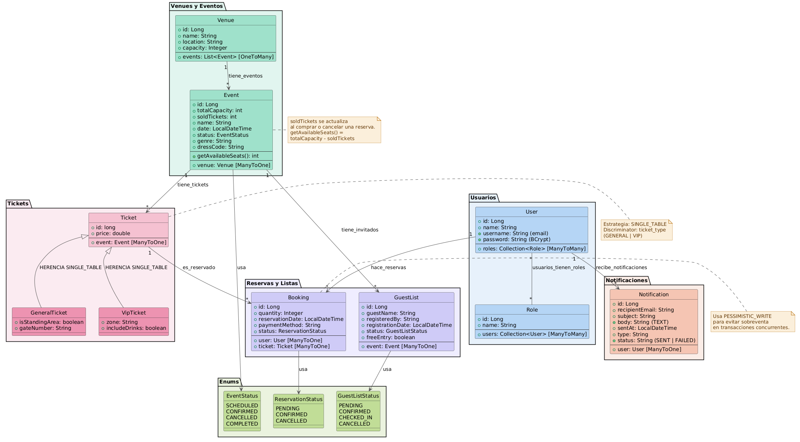

# 🌙 NightOut AI


Backend REST API para descubrir eventos nocturnos en la Comunidad de Madrid, comprar entradas con control de aforo en tiempo real y recibir recomendaciones personalizadas con Inteligencia Artificial (Asistente RRPP).

---

## 📋 Índice:

- [Descripción del proyecto](#-descripción-del-proyecto)
- [Funcionalidades](#-funcionalidades)
- [Diagrama de clases](#-diagrama-de-clases)
- [Tecnologías utilizadas](#-tecnologías-utilizadas)
- [Arquitectura del proyecto](#-arquitectura-del-proyecto)
- [Estructura de la API](#-estructura-de-la-api)
- [Modelo de datos](#-modelo-de-datos)
- [Configuración y arranque](#-configuración-y-arranque)
- [Lo que aprendí](#-lo-que-aprendí)
- [Trabajo futuro](#-trabajo-futuro)
- [Enlaces](#-enlaces)

---

## 🎯 Descripción del proyecto:

**NightOut AI** nace de una idea simple: ¿y si pudieras tener un relaciones públicas virtual que te recomiende planes de fiesta en Madrid según tus gustos, te apunte en las listas de invitados y te avise cuando haya eventos nuevos en tus sitios favoritos?

Este es mi proyecto final del bootcamp de Java Backend Developer en Ironhack. Lo desarrollé pensando en dos cosas:

1. **Cumplir con los requisitos académicos** — CRUD completo, autenticación Bearer, herencia JPA, MySQL, clean architecture.
2. **Demostrar algo que marque la diferencia** — Integración real con Spring AI para que un asistente virtual entienda lenguaje natural y ejecute acciones en la base de datos.

El proyecto simula una aplicación de vida nocturna para la comunidad de Madrid, con datos realistas de salas emblemáticas como WiZink Center, Sala La Riviera, Teatro Barceló o Sala El Sol.

---

## ✨ Funcionalidades:

### Autenticación y usuarios
- Registro de usuarios con contraseña encriptada (BCrypt)
- Login con JWT (JSON Web Token) con HMAC256
- Roles: `ROLE_USER` y `ROLE_ADMIN`
- Los administradores pueden crear eventos y gestionar salas

### Gestión de eventos y salas (CRUD completo)
- **Salas (Venues):** crear, listar, buscar por ubicación, actualizar, eliminar
- **Eventos:** crear, listar, filtrar por género musical, actualizar, eliminar
- Cada evento tiene género musical, código de vestimenta, capacidad total y fecha

### Compra de entradas con control de aforo
- Sistema de tickets con herencia JPA (Ticket → GeneralTicket / VipTicket)
- Las reservas (Bookings) verifican el aforo disponible antes de confirmar
- Bloqueo pesimista (`PESSIMISTIC_WRITE`) para evitar sobreventa en concurrencia
- Al cancelar una reserva, se libera el cupo automáticamente
- Las reservas quedan asociadas al usuario autenticado vía JWT

### Inteligencia Artificial con Spring AI
- **Chat simple:** el usuario puede preguntar cualquier cosa a la IA
- **Chat con memoria:** la IA recuerda la conversación (últimos 20 mensajes)
- **RRPP Virtual:** un asistente con personalidad de relaciones públicas que:
  - Recomienda eventos según género musical, ubicación y presupuesto
  - Explica el código de vestimenta y los precios
  - Tiene una regla humorística: si tu presupuesto es menor a €10, te dice que vayas a McDonald's 😄
  - **Apunta en la lista de invitados** al usuario y sus amigos directamente en MySQL

### Lista de invitados (GuestList)
- Nueva entidad que registra quién va a cada evento
- La IA puede apuntar personas en la lista automáticamente desde el chat
- Soporta entrada gratis o descuento en puerta

### Notificaciones por correo electrónico
- Sistema de recomendaciones personalizadas por email
- Analiza el historial de compras del usuario y busca eventos futuros en las mismas salas
- Envío automático cada lunes a las 10 AM (programado con `@Scheduled`)
- Se puede probar manualmente con un endpoint dedicado

---

## 📊 Diagrama de clases



## 🛠 Tecnologías utilizadas:

| Área | Tecnología |
|------|-----------|
| **Lenguaje** | Java 25 |
| **Framework** | Spring Boot 4.0.6 |
| **API REST** | Spring Web MVC |
| **Seguridad** | Spring Security + JWT (auth0/java-jwt) |
| **Persistencia** | Spring Data JPA + MySQL 8 + H2 (dev) |
| **Inteligencia Artificial** | Spring AI 2.0.0-M6 + OpenAI |
| **Correo electrónico** | Spring Mail (JavaMailSender + Gmail SMTP) |
| **Build** | Maven Wrapper |
| **IDE** | IntelliJ IDEA |
| **Testing APIs** | Postman / IntelliJ HTTP Client |

---

## 🏗 Arquitectura del proyecto:

El proyecto sigue el patrón **MVC por capas**. Cada capa tiene una responsabilidad bien definida:

```
┌─────────────────────────────────────────────────┐
│                  Controller                      │  ← Recibe peticiones HTTP
│  @RestController, @RequestMapping               │     Delega al Service
├─────────────────────────────────────────────────┤
│                   Service                        │  ← Lógica de negocio
│  @Service, @Transactional                       │     Reglas, validaciones
├─────────────────────────────────────────────────┤
│                  Repository                      │  ← Acceso a base de datos
│  extends JpaRepository                          │     Spring Data JPA
├─────────────────────────────────────────────────┤
│                    Model                         │  ← Entidades JPA
│  @Entity, relaciones, herencia                  │     Mapeo a tablas MySQL
├─────────────────────────────────────────────────┤
│                     DTO                          │  ← Objetos de transferencia
│  request/response, Lombok @Data                 │     No expongo entidades
├─────────────────────────────────────────────────┤
│                   Security                       │  ← Filtros JWT
│  CustomAuthenticationFilter                     │     Login + autorización
│  CustomAuthorizationFilter                      │     Validación de tokens
├─────────────────────────────────────────────────┤
│                    Tools                         │  ← Herramientas para Spring AI
│  @Tool, @ToolParam                              │     Las que la IA puede invocar
└─────────────────────────────────────────────────┘
```

### Estructura de carpetas:

```
src/main/java/com/ironhack/nightoutai/
├── config/          → Configuración de Spring (ChatMemory, etc.)
├── controller/      → Controladores REST (7 controladores)
├── demo/            → DataLoaders para seed data al arrancar
├── dto/             → Data Transfer Objects (6 DTOs)
├── enums/           → Enumeraciones (EventStatus, ReservationStatus, etc.)
├── exception/       → Manejador global de excepciones
├── model/           → Entidades JPA (9 modelos)
├── repository/      → Repositorios Spring Data JPA (7 repos)
├── security/        → Seguridad: filtros JWT, config, encoder
├── service/         → Lógica de negocio (12 servicios)
│   └── impl/        → Implementaciones de interfaces de servicio
└── tools/           → Tools para Spring AI (EventTools, GuestListTools)
```

---

## 🌐 Estructura de la API:

### Autenticación

| Método | Ruta | Descripción | Acceso |
|--------|------|-------------|--------|
| POST | `/api/login` | Iniciar sesión (devuelve JWT) | Público |
| POST | `/api/users` | Registrar nuevo usuario | Público |
| GET | `/api/users` | Listar usuarios | USER / ADMIN |
| POST | `/api/roles` | Crear rol | ADMIN |
| POST | `/api/roles/add-to-user` | Asignar rol a usuario | ADMIN |

### Salas (Venues)

| Método | Ruta | Descripción |
|--------|------|-------------|
| GET | `/api/venues` | Listar todas las salas |
| GET | `/api/venues/{id}` | Ver sala por ID |
| GET | `/api/venues/location/{location}` | Buscar por ubicación |
| POST | `/api/venues` | Crear sala |
| PUT | `/api/venues/{id}` | Actualizar sala |
| DELETE | `/api/venues/{id}` | Eliminar sala |

### Eventos

| Método | Ruta | Descripción |
|--------|------|-------------|
| GET | `/api/events` | Listar todos los eventos |
| GET | `/api/events/{id}` | Ver evento por ID |
| POST | `/api/events` | Crear evento (ADMIN) |
| PUT | `/api/events/{id}` | Actualizar evento |
| DELETE | `/api/events/{id}` | Eliminar evento |

### Tickets

| Método | Ruta | Descripción |
|--------|------|-------------|
| GET | `/api/tickets` | Listar todos los tickets |
| GET | `/api/tickets/{id}` | Ver ticket por ID |
| POST | `/api/tickets` | Crear ticket (USER / ADMIN) |
| PUT | `/api/tickets/{id}` | Actualizar ticket |
| DELETE | `/api/tickets/{id}` | Eliminar ticket |

### Reservas (Bookings)

| Método | Ruta | Descripción |
|--------|------|-------------|
| POST | `/api/bookings` | Crear reserva |
| GET | `/api/bookings` | Listar reservas |
| GET | `/api/bookings/{id}` | Ver reserva |
| PUT | `/api/bookings/{id}` | Actualizar reserva |
| DELETE | `/api/bookings/{id}` | Cancelar reserva |

### Inteligencia Artificial

| Método | Ruta | Descripción |
|--------|------|-------------|
| GET | `/chat/ask?question=` | Preguntar a la IA |
| GET | `/chat/chatbot/{conversationId}?message=` | Chat con memoria |
| GET | `/event-chat/recommend?message=` | RRPP virtual: recomendaciones + lista invitados |

### Notificaciones

| Método | Ruta | Descripción |
|--------|------|-------------|
| GET | `/api/notifications/test-recommend` | Enviar correo de prueba con recomendaciones |
| GET | `/api/notifications/my-history` | Ver historial de correos recibidos |
| GET | `/api/notifications/all` | Ver todos los correos (admin) |
| POST | `/api/notifications/trigger-weekly` | Forzar envío semanal manualmente |

---

## 💾 Modelo de datos:

### Entidades y relaciones

```
User (users)
├── id (PK)
├── name
├── username (email)
├── password (BCrypt)
└── roles (ManyToMany → Role)

Role (roles)
├── id (PK)
├── name (ROLE_USER, ROLE_ADMIN)
└── users (ManyToMany → User)

Venue (venue)
├── id (PK)
├── name (WiZink Center, Sala La Riviera, etc.)
├── location (Madrid)
├── capacity (350 a 25.000)
└── events (OneToMany → Event)

Event (event)
├── id (PK)
├── name
├── date (LocalDateTime)
├── totalCapacity
├── soldTickets
├── status (SCHEDULED, CONFIRMED, CANCELLED, COMPLETED)
├── genre (Rock, Electrónica, Jazz, Reggaetón, etc.)
├── dressCode (Casual, Elegante, Fiesta, Formal, Temático)
└── venue (ManyToOne → Venue)

Ticket (ticket) — SINGLE_TABLE inheritance
├── id (PK)
├── price
├── event (ManyToOne → Event)
├── ticket_type (discriminator: GENERAL, VIP)
│
├── GeneralTicket
│   ├── standingArea (boolean)
│   └── gateNumber
│
└── VipTicket
    ├── zone
    └── includeDrinks (boolean)

Booking (booking)
├── id (PK)
├── user (ManyToOne → User)
├── ticket (ManyToOne → Ticket)
├── quantity
├── reservationDate
├── paymentMethod
└── status (PENDING, CONFIRMED, CANCELLED)

GuestList (guest_list)
├── id (PK)
├── guestName
├── event (ManyToOne → Event)
├── registeredBy
├── registrationDate
├── status (PENDING, CONFIRMED, CHECKED_IN, CANCELLED)
└── freeEntry (boolean)

Notification (notification)
├── id (PK)
├── user (ManyToOne → User)
├── recipientEmail
├── subject
├── body (TEXT)
├── sentAt
├── type (RECOMMENDATION, PROMOTION, REMINDER)
└── status (SENT, FAILED)
```

### Estrategia de herencia:

Los tickets usan **SINGLE_TABLE** porque:

- Son una jerarquía simple con pocas diferencias entre clases
- Las consultas son más rápidas (una sola tabla)
- No tiene sentido tener tablas separadas para GeneralTicket y VipTicket
- La columna `ticket_type` funciona como discriminador

Para la venta de entradas usé **bloqueo pesimista (`PESSIMISTIC_WRITE`)** en lugar de optimista porque:

- La concurrencia real en una compra de entradas es baja
- Prefiero que un usuario espere milisegundos a que tenga que reintentar
- Garantiza que no haya sobreventa incluso con picos de tráfico

---

## ⚙️ Configuración y arranque:

### Requisitos previos

- Java 25+
- Maven Wrapper (incluido)
- MySQL 8+
- Cuenta de OpenAI con API key (para Spring AI)
- (Opcional) Cuenta de Gmail con contraseña de aplicación (para correos)

### Variables de entorno

```bash
# Obligatorias
export MYSQL_PASSWORD=tu_contraseña_mysql
export OPENAI_API_KEY=sk-tu_api_key_openai

# Opcionales (para el sistema de correos)
export MAIL_USERNAME=tu_correo@gmail.com
export MAIL_PASSWORD=tu_contraseña_de_aplicacion
```

### Base de datos:

```sql
CREATE DATABASE nightout_db;
```

La app crea las tablas automáticamente con `ddl-auto: create-drop`.

### Arranque

```bash
# Clonar el repositorio
git clone https://github.com/EngerDuran/nightOut-ai.git
cd nightOut-ai

# Compilar y ejecutar
./mvnw spring-boot:run
```

Al arrancar, los DataLoaders siembran automáticamente:

- **4 usuarios** con roles (2 clientes + 2 administradores)
- **8 salas** emblemáticas de Madrid
- **10 eventos** con géneros y dress codes
- **20 tickets** (General + VIP por cada evento)

### Usuarios de prueba:

| Usuario | Contraseña | Rol |
|---------|-----------|-----|
| carlos.perez@gmail.com | Carlos2026! | ROLE_USER |
| lucia.ortiz@gmail.com | LuciaO99! | ROLE_USER |
| alex.garrido@nightout.ai | Kapital2026! | ROLE_ADMIN |
| sara.villanueva@nightout.ai | SaraRrpp2026! | ROLE_ADMIN + ROLE_USER |

---

## 🧠 Lo que aprendí:

Este proyecto me llevó bastante más allá de lo que vimos en clase. Cosas que aprendí investigando y equivocándome:

### Spring Security + JWT
- Implementar filtros personalizados (`OncePerRequestFilter`) para validar tokens
- Manejar la autenticación sin depender de formularios de login de Spring
- Extraer roles del token y usarlos para autorización por endpoint

### Concurrencia en base de datos
- La diferencia entre bloqueo optimista y pesimista
- Cuándo usar `PESSIMISTIC_WRITE` (venta de entradas) vs `OPTIMISTIC` (actualizaciones de perfil)
- Por qué `@Transactional` es clave para que los locks funcionen

### Spring AI
- Cómo Spring AI usa `ChatClient.Builder` para crear asistentes
- La diferencia entre `ChatClient` (sin memoria) y `ChatClient` con `MessageChatMemoryAdvisor`
- Cómo funcionan las tools (`@Tool`, `@ToolParam`) — la IA decide CUÁNDO llamarlas según el contexto
- Escribir un system prompt efectivo: definir personalidad, reglas estrictas y casos límite

### Herencia JPA
- `SINGLE_TABLE` vs `JOINED` vs `TABLE_PER_CLASS`
- Cuándo cada una tiene sentido
- Cómo funciona `@DiscriminatorColumn` y `@DiscriminatorValue`

### Arquitectura
- Separar DTOs de las entidades para no exponer la base de datos
- Manejador global de excepciones con `@RestControllerAdvice`
- Inyección de dependencias con `@RequiredArgsConstructor` + `final`
- Tareas programadas con `@Scheduled` y expresiones cron

### Lo que haría diferente
- Agregaría tests desde el principio en lugar de al final
- Usaría DTOs también para las respuestas (no solo para requests)
- Separaría mejor las responsabilidades de `BookingService`
- Agregaría un perfil de test con H2 para no depender de MySQL

---

## 🔮 Trabajo futuro y mejoras planificadas

Este proyecto es un MVP funcional, pero hay muchas cosas que me gustaría mejorar para llevarlo a un nivel profesional. Acá van ordenadas por prioridad:

### Calidad y testing
- [ ] **Tests unitarios** con JUnit 5 + Mockito para todos los servicios (EventService, BookingService, EmailService)
- [ ] **Tests de integración** con `@SpringBootTest` y base de datos H2 embebida
- [ ] **Tests de controladores** con `@WebMvcTest` para probar los endpoints con autenticación
- [ ] **Perfil `test`** con H2 en `application-test.yaml` para no depender de MySQL en los tests
- [ ] **Cobertura de código** con JaCoCo (mínimo 70%)

### Seguridad
- [ ] **Refresh tokens** además del access token (el actual expira a los 10 minutos)
- [ ] **Validación de roles más granular** por endpoint (ej: solo ADMIN puede borrar eventos)
- [ ] **Rate limiting** para evitar abusos en los endpoints de login y chat
- [ ] **Logs de auditoría** (quién creó qué, cuándo, desde qué IP)
- [ ] **CSRF protection** (actualmente deshabilitada para simplificar)

### Pagos y monetización
- [ ] Integración con **Stripe** o **PayPal** para pagos reales
- [ ] **Recarga de saldo** en la cuenta del usuario
- [ ] **Sistema de comisiones** por entrada vendida
- [ ] **Facturación** y generación de recibos

### Experiencia de usuario
- [ ] **Códigos QR** en las entradas (con `zxing` o similar)
- [ ] **Cancelación de reservas** con política de reembolso
- [ ] **Notificaciones push** además del correo electrónico
- [ ] **Historial completo** de eventos asistidos por el usuario
- [ ] **Valoración de eventos** (sistema de estrellas o reseñas)

### Frontend (si algún día lo conecto)
- [ ] App web con React o Angular
- [ ] App móvil con Flutter o React Native
- [ ] Dashboard administrativo con gráficos y estadísticas
- [ ] Mapa interactivo de salas y eventos

### DevOps y despliegue
- [ ] **Dockerizar** la aplicación (Dockerfile + docker-compose con MySQL)
- [ ] **CI/CD** con GitHub Actions (tests automáticos en cada push)
- [ ] Despliegue en **Render**, **Railway** o **AWS**
- [ ] **Variables de entorno** documentadas en un `.env.example`
- [ ] **Script de backup** de la base de datos

### Inteligencia Artificial
- [ ] Implementar **MCP (Model Context Protocol)** para expandir las capacidades del asistente
- [ ] Recomendaciones más avanzadas basadas en histórico de compras del usuario
- [ ] Asistente con capacidad de **mantener conversaciones más largas** (memoria persistente en DB)
- [ ] **Traducción automática** para usuarios internacionales
- [ ] **Reconocimiento de voz** para interactuar con el asistente

### Calidad de código
- [ ] Response DTOs (actualmente devuelvo las entidades directamente)
- [ ] `@Valid` y `@Validated` para validar los DTOs de entrada
- [ ] Documentación con **Swagger / OpenAPI**
- [ ] **Caché** con Redis para consultas frecuentes (ej: lista de eventos)
- [ ] Refactorizar `BookingService` en varios servicios más pequeños
- [ ] Agregar **índices de base de datos** para consultas frecuentes

---

## 🔗 Enlaces

- **Repositorio:** [github.com/EngerDuran/nightOut-ai](https://github.com/EngerDuran/nightOut-ai)
- **GitHub Project:** [NightOut AI MVP Roadmap](https://github.com/users/EngerDuran/projects/1)
- **Documentación adicional:** `docs/propuesta_proyecto_nightout_ai.pdf`

---

## 👤 Miembros del equipo

- **Enger Durán** — Estudiante de Ironhack Java Backend Developer
- Proyecto individual

---

*Este proyecto fue desarrollado como trabajo final del bootcamp de Ironhack. Si llegaste hasta aquí, ¡de verdad muchas gracias por leer! Si tienes alguna sugerencia o quieres colaborar, cualquier issue o PR es bienvenido.* 🙌
