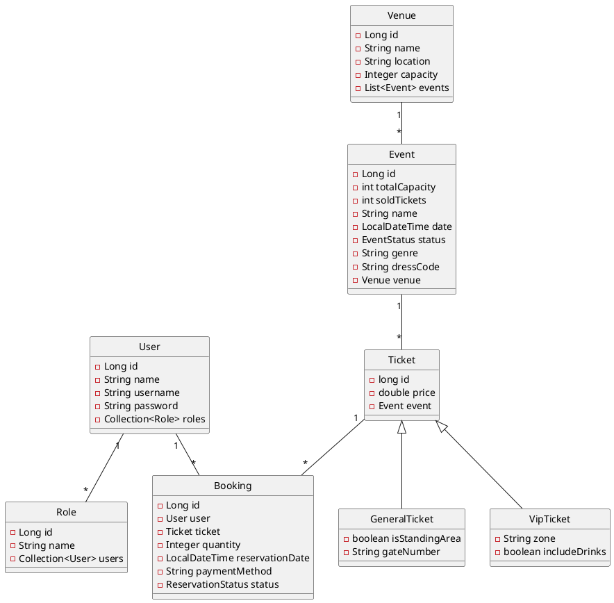

# Revisión de Proyecto Final — NightOut AI

> **Para:** Enger Durán  
> **Proyecto:** NightOut AI — Ironhack Java Backend Developer  
> **Estado:** Pre-entrega  
> **Fecha:** Junio 2026

---

## 1. Disclaimer importante

He releído los requisitos del proyecto y esto es lo que pide explícitamente:

- ✅ API REST con Java + Spring Boot
- ✅ CRUD con al menos una ruta GET, POST, PUT/PATCH, DELETE
- ✅ 3+ modelos con relación Padre/Hijo y herencia JPA (SINGLE_TABLE, JOINED, TABLE_PER_CLASS)
- ✅ Base de datos MySQL
- ✅ Autenticación Bearer con Spring Security
- ✅ Repositorio en GitHub
- ✅ Múltiples commits + ramas de características (feature branches)
- ✅ Diagrama de clases UML en el README
- ✅ Tareas creadas en gestor de tareas
- ✅ Buena estructura de carpetas, nomenclatura, código limpio
- ✅ Comentarios solo donde sea necesario
- ✅ README con: Descripción, Diagrama de clases, Configuración, Tecnologías, Estructura de rutas, Enlaces, Trabajo futuro, Recursos, Miembros

**Los tests NO son un requisito del bootcamp.** Los menciono como recomendación para tu portfolio laboral, pero si tu prioridad es entregar a tiempo, enfocate en lo que sí es obligatorio.

---

## 2. Lo que ya está muy bien ✅

### Spring Security + JWT
Implementación sólida con `CustomAuthenticationFilter` y `CustomAuthorizationFilter`. Usás HMAC256, extraés roles del token, manejás errores 403. Esto es exactamente lo que Spring Security Bearer pide y pesa MUCHO en entrevistas.

### Herencia JPA bien aplicada
`Ticket` (padre) → `GeneralTicket` / `VipTicket` (hijas) con `SINGLE_TABLE`. El requirement pide exactamente esto: "3 modelos con relación Padre/Hijo e implementar la mejor estrategia de herencia JPA". Lo cumplís.

### CRUD completo en 3 entidades
- **Events**: GET, POST, PUT, DELETE
- **Venues**: GET, POST, PUT, DELETE (+ GET por location)
- **Tickets**: GET, POST, PUT, DELETE

### Spring AI
Esto es lo que hace DIFERENTE tu proyecto. Tenés:
- `ChatService` con memoria conversacional (`MessageChatMemoryAdvisor`)
- `EventChatService` con sistema de recomendación (RRPP virtual)
- `EventTools` con `@Tool` annotations para buscar eventos por location y género
- System prompt con personalidad y reglas (¡el chiste del presupuesto de €10 es buenísimo!)

### Pesimistic Locking
`@Lock(PESSIMISTIC_WRITE)` en `findByIdForUpdate` — demostrás que pensaste en concurrencia para la venta de entradas.

### Seed Data
8 venues, 10 eventos con género y dress code, 20 tickets. Datos realistas de la escena de Madrid.

### Arquitectura en capas
Controller → Service → Repository, con DTOs separados y un `RestExceptionHandler` global.

---

## 3. Lo que hay que arreglar SÍ o SÍ (obligatorio para aprobar) 🔴

Esto está basado estrictamente en los requisitos del bootcamp.

### 3.1 Diagrama de clases UML

El README dice "pendiente". Es requisito explícito:
> "Crea el diagrama de clases antes de comenzar tu proyecto e inclúyelo en el archivo Readme."

**Qué hacer:**
- Crear un archivo `docs/uml/nightout-class-diagram.puml` (PlantUML)
- O crear una imagen y subirla a `docs/uml/diagram.png`
- Incluirlo en el README con ``

Ejemplo mínimo de PlantUML para tu proyecto:



### 3.2 BookingController está incompleto

El requirement dice:
> "al menos una ruta GET, POST, PUT/PATCH y DELETE"

**Booking solo tiene POST.** Necesitás implementar:

```java
@RestController
@RequestMapping("/api/bookings")
@RequiredArgsConstructor
public class BookingController {

    private final BookingService bookingService;

    @PostMapping
    public ResponseEntity<Booking> createBooking(@RequestBody BookingRequestDTO request) {
        Booking newBooking = bookingService.createBooking(
                request.getTicketId(),
                request.getQuantity(),
                request.getPaymentMethod()
        );
        return new ResponseEntity<>(newBooking, HttpStatus.CREATED);
    }

    // 🔴 FALTAN:

    @GetMapping
    public ResponseEntity<List<Booking>> getAllBookings() {
        // Obtener reservas del usuario autenticado
        return ResponseEntity.ok(bookingService.getUserBookings());
    }

    @GetMapping("/{id}")
    public ResponseEntity<Booking> getBookingById(@PathVariable Long id) {
        return ResponseEntity.ok(bookingService.findById(id));
    }

    @PutMapping("/{id}")
    public ResponseEntity<Booking> updateBooking(@PathVariable Long id,
                                                  @RequestBody BookingRequestDTO request) {
        return ResponseEntity.ok(bookingService.updateBooking(id, request));
    }

    @DeleteMapping("/{id}")
    public ResponseEntity<Void> cancelBooking(@PathVariable Long id) {
        bookingService.cancelBooking(id);
        return ResponseEntity.noContent().build();
    }
}
```

Además hay que arreglar `BookingService` porque:
- No asocia el `Booking.user` con el usuario autenticado (se queda en `null`)
- Usa `RuntimeException` genérica en vez de `ResponseStatusException`

### 3.3 EventRequestDTO no incluye genre ni dressCode

Agregaste `genre` y `dressCode` al `Event` pero el DTO de creación no los tiene. Así que POST `/api/events` no puede crearlos.

**Solución:** Agregar los campos al DTO y al mapeo en el controller:

```java
// EventRequestDTO.java — agregar:
private String genre;
private String dressCode;
```

```java
// EventController.java — agregar en addEvent():
event.setGenre(dto.getGenre());
event.setDressCode(dto.getDressCode());
```

---

## 4. Lo que deberías arreglar (calidad profesional) 🟡

### 4.1 LoginController está vacío

```java
public class LoginController { }
```

Esto es código muerto. O lo borrás o lo implementás (aunque el login ya funciona via `/api/login` con el filter).

### 4.2 Inconsistencia en rutas

- `EventController` → `/api/events`
- `VenueController` → `/api/venues`
- `TicketController` → `/api/tickets`
- `BookingController` → `/bookings` (sin `/api`)

Unifica todo bajo `/api/...`.

### 4.3 Booking no asocia el usuario

En `BookingService.createBooking()`, el `Booking.user` nunca se setea. Usá `SecurityContextHolder` para obtener el usuario autenticado:

```java
Authentication auth = SecurityContextHolder.getContext().getAuthentication();
String username = auth.getName();
User user = userRepository.findByUsername(username);
booking.setUser(user);
```

### 4.4 Excepciones genéricas en BookingService

```java
// MAL
throw new RuntimeException("Ticket not available");

// BIEN
throw new ResponseStatusException(HttpStatus.NOT_FOUND, "Ticket not available");
```

### 4.5 RestExceptionHandler solo maneja Exception genérica

No va a capturar `ResponseStatusException` correctamente. Mejor:

```java
@ExceptionHandler(ResponseStatusException.class)
public ResponseEntity<ErrorResponse> handleResponseStatus(ResponseStatusException ex) {
    ErrorResponse error = new ErrorResponse();
    error.setStatusCode(ex.getStatusCode().value());
    error.setMessage(ex.getReason());
    error.setDate(LocalDateTime.now());
    return new ResponseEntity<>(error, ex.getStatusCode());
}
```

O usá directamente `@ResponseStatus` en los métodos del controller.

### 4.6 Contraseña de MySQL en texto plano

```yaml
password: Goku58#.
```

Usá variable de entorno:

```yaml
password: ${MYSQL_PASSWORD}
```

Así podés subir el repo a GitHub sin exponer credenciales.

---

## 5. Lo que suma para tu PORTFOLIO (no obligatorio) 🟢

### 5.1 Tests (recomendadísimo para conseguir trabajo)

Aunque el bootcamp no los exija, en una entrevista técnica junior te van a preguntar:
- "¿Cómo testearías esta aplicación?"
- "¿Conocés JUnit, Mockito, Spring Boot Test?"

Hacé al menos:

```bash
./mvnw test
```

Con estos tests mínimos:

```java
// 1. Test de servicio
@SpringBootTest
class EventServiceTest {
    @Test
    void addEvent_shouldSetTotalCapacityFromVenue() { ... }
}

// 2. Test de controlador
@WebMvcTest(EventController.class)
class EventControllerTest {
    @Test
    void getAll_shouldReturn200() { ... }
}
```

### 5.2 Perfil de test con H2

Para que los tests no necesiten MySQL:

```yaml
# src/test/resources/application-test.yaml
spring:
  datasource:
    url: jdbc:h2:mem:testdb
  jpa:
    hibernate:
      ddl-auto: create-drop
```

### 5.3 README — Tabla de rutas

El requirement pide "Estructura de controladores y rutas". Agregá una tabla así:

```markdown
## Rutas de la API

| Método | Ruta | Descripción | Autenticación |
|--------|------|-------------|---------------|
| POST | /api/login | Iniciar sesión | Pública |
| POST | /api/events | Crear evento | ADMIN |
| GET | /api/events | Listar eventos | Autenticado |
| GET | /api/events/{id} | Ver evento | Autenticado |
| PUT | /api/events/{id} | Actualizar evento | ADMIN |
| DELETE | /api/events/{id} | Eliminar evento | ADMIN |
| GET | /api/venues | Listar salas | Autenticado |
| GET | /api/venues/{id} | Ver sala | Autenticado |
| POST | /api/venues | Crear sala | ADMIN |
| PUT | /api/venues/{id} | Actualizar sala | ADMIN |
| DELETE | /api/venues/{id} | Eliminar sala | ADMIN |
| GET | /api/venues/location/{location} | Buscar por ubicación | Autenticado |
| GET | /api/tickets | Listar tickets | Autenticado |
| POST | /api/tickets | Crear ticket | USER/ADMIN |
| GET | /api/tickets/{id} | Ver ticket | Autenticado |
| PUT | /api/tickets/{id} | Actualizar ticket | ADMIN |
| DELETE | /api/tickets/{id} | Eliminar ticket | ADMIN |
| POST | /api/bookings | Crear reserva | Autenticado |
| GET | /api/users | Listar usuarios | USER/ADMIN |
| POST | /api/users | Registrar usuario | Pública |
| POST | /api/roles | Crear rol | ADMIN |
| POST | /api/roles/add-to-user | Asignar rol | ADMIN |
| GET | /api/greet | Saludo público | Autenticado |
| GET | /api/greet/personal | Saludo personal | Autenticado |
| GET | /chat/ask | Chat simple | Autenticado |
| GET | /chat/chatbot/{id} | Chat con memoria | Autenticado |
| GET | /event-chat/recommend | Recomendación IA | Autenticado |
```

### 5.4 QR y pagos (Trabajo futuro)

En el README ya mencionás trabajo futuro. Está bien. Si querés sumar puntos extra ANTES de la entrega, un QR simple con `zxing` es relativamente fácil.

---

## 6. Resumen: checklist de entrega

### Obligatorio para aprobar (prioridad máxima)

- [ ] Diagrama de clases UML creado e incluido en README
- [ ] BookingController con GET, PUT, DELETE completos
- [ ] BookingService asocia usuario autenticado
- [ ] EventRequestDTO incluye genre y dressCode
- [ ] EventController mapea genre y dressCode
- [ ] LoginController eliminado o implementado
- [ ] Ruta de BookingController unificada a `/api/bookings`

### Calidad profesional (recomendado)

- [ ] Contraseña MySQL en variable de entorno
- [ ] Excepciones específicas (ResponseStatusException) en BookingService
- [ ] RestExceptionHandler maneja ResponseStatusException

### Portfolio laboral (opcional, pero suma mucho)

- [ ] Tests básicos de servicio y controlador
- [ ] Perfil H2 para tests
- [ ] Tabla de rutas en README
- [ ] UML en PlantUML dentro de `docs/uml/`

---

## 7. Plan sugerido para la semana

| Día | Tarea | Tiempo estimado |
|-----|-------|----------------|
| Lunes | UML class diagram + incluirlo en README | 2-3h |
| Martes | Completar BookingController + BookingService (GET, PUT, DELETE, user auth) | 4-5h |
| Miércoles | Arreglar EventRequestDTO + mapeo en controller | 1h |
| Jueves | Pull requests, commits, pulir README, tabla de rutas | 3-4h |
| Viernes | (Opcional) Tests básicos + perfil H2 | 4-5h |
| finde | Revisión final, grabar demo, preparar presentación | 2-3h |

---

## 8. Conclusión

**Tu proyecto está avanzado y bien encaminado.** Lo de Spring AI + el RRPP virtual con system prompt gracioso es un diferenciador real. La mayoría de proyectos de bootcamp no tienen IA.

Lo que te juega en contra es que los detalles finos (Booking incompleto, DTO desactualizado, UML faltante) son justamente los requisitos explícitos. Son arreglos chicos pero críticos.

Si esta semana clavás los 🔴 y los 🟡, entregás un proyecto SÓLIDO.

¡Mucha suerte, amigo! Cualquier cosa acá estoy.
